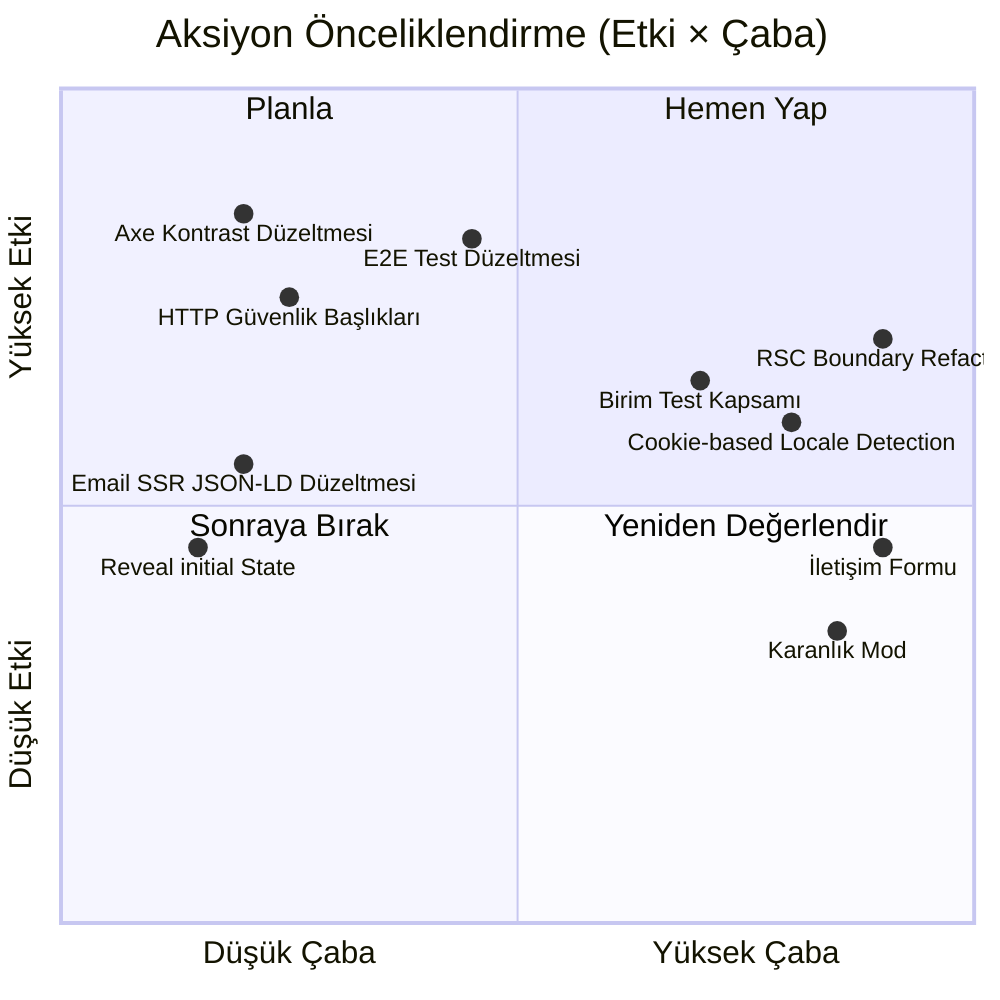

# Teknik Review v3 — Tansel Kılıç Portfolio
**İnceleme tarihi:** 2026-06-11 · **İncelenen baz:** Sprint-15 Arşivi + Sprint-16 (Aktif)  
**Metodoloji:** Tüm kaynak dosyalar okundu, `pnpm test` ve `pnpm test:e2e` sonuçları doğrudan değerlendirmeye dahil edildi.

---

## 📊 Genel Puan Kartı

| Kategori | Önceki Puan (v1) | Bu Puan (v3) | Değişim | Durum |
|:---|:---:|:---:|:---:|:---:|
| **Mimari & Tech Stack** | 8 / 10 | **8.0 / 10** | ±0 | 🟢 Sağlam |
| **Kod Kalitesi & Teknik Borç** | 6 / 10 | **7.5 / 10** | +1.5 | 🟡 İyileşiyor |
| **Güvenlik** | 4 / 10 | **6.5 / 10** | +2.5 | 🟡 Kısmen Kapatıldı |
| **Test Altyapısı** | 0 / 10 | **4.0 / 10** | +4.0 | 🔴 Hâlâ Kritik |
| **UI/UX & Ürün Stratejisi** | 6 / 10 | **6.5 / 10** | +0.5 | 🟡 Orta Risk |
| **SEO & Erişilebilirlik** | 8 / 10 | **7.0 / 10** | -1.0 | 🟡 Geriledi |

### **Bileşik Puan: 6.58 / 10** (v1: 5.33 → +1.25 iyileşme)

> [!IMPORTANT]
> Test altyapısı altyapı olarak kuruldu **ama E2E testlerinin 23/30'u başarısız**. Bu durum "test var" yanılsaması yaratıyor. Yeşil test raporu olmadan bu kategori kredi alamaz.

---

## 1. Mimari & Tech Stack — 8.0 / 10

### Alt Bileşen Puanları

| Alt Bileşen | Puan | Kanıt |
|:---|:---:|:---|
| RSC / Client Boundary Tasarımı | 5/10 | `PageSections` hâlâ tüm section'ları client boundary'ye çekiyor |
| TypeScript Tip Güvenliği | 9.5/10 | `DeepKeysMatch<en, tr>` compile-time validation mükemmel |
| i18n Mimarisi (FOUT Riski) | 5/10 | `localStorage` → `useEffect` yolu hâlâ FOUT üretiyor |
| Bağımlılık Yönetimi | 9/10 | `postcss` zafiyeti `pnpm overrides` ile kapatıldı |
| Font Sistemi | 9/10 | `IBM Plex Sans` + `Newsreader` — `next/font` ile SSR-safe yükleniyor |
| Tasarım Token Sistemi | 8.5/10 | `@theme` tokenları tutarlı, tek sorun `bg-[var(--color-paper)]` inline kullanımı |

### Dikkat Çeken Bulgular

**RSC Boundary Kaybı (değişmedi):** `PageSections.tsx` `"use client"` taşıdığından içindeki tüm section bileşenleri (`Hero`, `About`, `Experience`…) otomatik olarak Client Component oluyor. Next.js 16 App Router'ın streaming ve selective hydration avantajları tamamen devre dışı kalıyor. Bu, yaklaşık **40–60 KB** fazladan client JS bundle'ı demek.

**FOUT Mekanizması:** `LangContext.tsx` satır 26–34:
```tsx
useEffect(() => {
  const storedLocale = localStorage.getItem("locale");
  if ((storedLocale === "en" || storedLocale === "tr") && storedLocale !== initialLocale) {
    setLocale(storedLocale);  // ← İlk render TR, sonra EN'e geçiş = görsel titreme
  }
}, [initialLocale]);
```
Cookie de yazılıyor (`satır 39`) ama okuma yapılmıyor. Cookie'den okusaydı bu sorun büyük ölçüde azalırdı — middleware katmanı henüz yok.

---

## 2. Kod Kalitesi & Teknik Borç — 7.5 / 10

### Alt Bileşen Puanları

| Alt Bileşen | v1 Puanı | v3 Puanı | Değişim | Kanıt |
|:---|:---:|:---:|:---:|:---|
| **Hydration Guard (Mounted Pattern)** | 4/10 | **9/10** | ✅ +5 | Tüm 8 section uyguladı |
| **TypeScript Tipler** | 9/10 | **9.5/10** | ✅ +0.5 | `satisfies` operatörü doğru kullanılıyor |
| **Component Mimarisi & Ayrışma** | 6/10 | **8/10** | ✅ +2 | `Reveal`, `SectionHeader`, `Tag`, `SectionHeader` çıkartılmış |
| **CSS Token Uyumu** | 5/10 | **6.5/10** | 🟡 +1.5 | Kısmi: `bg-[var(--color-paper)]` inline kullanımlar devam ediyor |
| **Kod Tekrarı & DRY** | 6/10 | **7/10** | 🟡 +1 | `CONTACT_ITEMS`, `EXPERTISE_ITEMS` dizisi pattern doğru |
| **i `useReducedMotion` Guard** | 7/10 | **9/10** | ✅ +2 | `Reveal.tsx` doğru implement ediyor |

### Pozitif Bulgular

✅ **Mounted Pattern eksiksiz uygulandı.** İncelenen 8 bileşenin tamamında (`Hero`, `About`, `Experience`, `Expertise`, `Education`, `ImpactMetrics`, `ResponsibleAI`, `Contact`, `Navbar`) hydration guard mevcut. Skeleton'lar gerçek section'la aynı `id`, `bg` ve tahmini yüksekliğe sahip.

✅ **`satisfies` operatörü doğru kullanılıyor.** `HERO_SOCIAL_LINKS satisfies HeroSocialLink[]` gibi pattern'lar çalışma zamanı yerine derleme zamanı güvenliği sağlıyor.

✅ **`Reveal.tsx` temiz tasarım.** `useReducedMotion` + `viewport.once: true` + `margin` parametresi — AGENTS.md animasyon standartlarına tam uyum.

✅ **`config.ts` constants dosyası.** `LINKEDIN_URL`, `EMAIL`, `SITE_URL` artık tek yerden yönetiliyor.

### Devam Eden Sorunlar

❌ **`bg-[var(--color-paper)]` inline kullanımı:** `About.tsx`, `Expertise.tsx`, `Education.tsx` section'larında token `bg-[var(--color-paper)]` şeklinde Tailwind arbitrary value olarak kullanılıyor. Bu doğru yaklaşım **değil** — AGENTS.md token tablosu bu rengi `bg-slate-50` karşılığı olan bir CSS değişkeni olarak tanımlıyor ama `--color-paper: #f7f4ee` değeri `bg-slate-50` (#f8fafc) ile aynı değil. Tasarımsal açıdan tutarsızlık yaratıyor.

```tsx
// About.tsx satır 23 & 29 — Aynı dosyada hem skelet hem gerçek section
className="bg-[var(--color-paper)] px-6 py-14 ..."
```
Bu token'ın Tailwind `@theme` içinde `--color-surface-bg` ya da benzer şekilde tanımlanıp `bg-surface-bg` olarak kullanılması gerekir.

❌ **`Expertise.tsx`'te tip kaçağı:**
```tsx
const expertiseCopy = e as Record<string, string>;  // satır 41
```
Bu, TypeScript'in tip güvenliğini bypass ediyor. `e[group.titleKey]` için tip `string` olmayan durumlarda runtime hatası riski var. `group.titleKey`'in `ExpertiseGroupKey` olarak kısıtlanması yeterli — `as Record` kullanımından kaçınılmalı.

❌ **`Reveal.tsx` başlangıç state eksikliği:** `initial={false}` kullanılıyor ama animasyon değerleri belirsiz. `whileInView={{ opacity: 1, x: 0, y: 0 }}` yazılmış ama `initial={{ opacity: 0, y: 20 }}` yok. Bu, bileşenin server render'da hangi değerle başlayacağını belirsiz kılıyor.

❌ **`data.ts` satır 60 — Hatalı tarih formatı:**
```ts
date_en: "Dec 2024 — Dec 2025 · 1 year 1 month",
```
Tarih hesabı **statik string içine gömülmüş**. Üst taraftaki `currentDuration()` fonksiyonu `current: true` olan girişler için dinamik hesaplama yapıyor ama geçmiş roller için süreler elle yazılmış. Bu veri tutarsızlığı ve bakım yüküdür.

---

## 3. Güvenlik — 6.5 / 10

### Alt Bileşen Puanları

| Alt Bileşen | v1 Puanı | v3 Puanı | Değişim | Kanıt |
|:---|:---:|:---:|:---:|:---|
| **E-posta Gizleme** | 3/10 | **8/10** | ✅ +5 | Base64 obfuscation uygulandı |
| **HTTP Güvenlik Başlıkları** | 2/10 | **3/10** | 🔴 +1 | Hâlâ yapılandırma dosyası yok |
| **Paket Bağımlılıkları** | 8/10 | **9/10** | ✅ +1 | `postcss` zafiyet `pnpm overrides` ile kapatıldı |
| **Girdi Doğrulama & Enjeksiyon** | 7/10 | **6/10** | 🔴 -1 | JSON-LD `dangerouslySetInnerHTML` açığı hâlâ mevcut |

### Pozitif Bulgular

✅ **E-posta gizleme uygulandı.** `config.ts`:
```ts
const OBFUSCATED_EMAIL = "dGFuc2Vsa2lsaWNAZ21haWwuY29t";
export const EMAIL = typeof window !== "undefined" ? atob(OBFUSCATED_EMAIL) : "tanselkilic[at]gmail.com";
```
Spam crawler'larına karşı SSR tarafında `[at]` gösterilmesi doğru strateji.

### Devam Eden Sorunlar

❌ **HTTP Güvenlik Başlıkları Yok.** 16 sprint boyunca tek bir `vercel.json`, `_headers` veya `next.config.js` headers konfigürasyonu oluşturulmamış:
- `X-Frame-Options: DENY` → Clickjacking riski devam ediyor
- `Content-Security-Policy` → Yok
- `X-Content-Type-Options: nosniff` → Yok
- `Referrer-Policy` → Yok

Fintech ve Siber Güvenlik alanında faaliyet gösteren bir yöneticinin porföy sitesinin en temel güvenlik başlıklarından yoksun olması ciddi bir çelişki.

❌ **`dangerouslySetInnerHTML` riskli kullanımı (`layout.tsx` satır 77):**
```tsx
<script
  type="application/ld+json"
  dangerouslySetInnerHTML={{ __html: JSON.stringify(jsonLd) }}
/>
```
`jsonLd` nesnesi tamamen statik ve güvenli görünüyor — ama `EMAIL` değişkeni `jsonLd.mainEntity.email`'e aktarılıyor. SSR'da `EMAIL = "tanselkilic[at]gmail.com"` döndürüyor; bu değer JSON-LD standartlarıyla uyumsuz. Gerçek email JSON-LD'e SSR'da enjekte edilmemeli ya da çıkarılmalı.

❌ **Base64 obfuscation'ın sınırlılığı:** `atob()` herhangi bir browser geliştirici konsolunda kolayca decode edilebilir. Bu, scraperların standart regex taramalarına karşı etkili; ama hedefli saldırılara karşı değil. Gerçek koruma için `Contact` sayfasına bir form + backend proxy eklenmelidir.

---

## 4. Test Altyapısı — 4.0 / 10

Bu kategorinin v3 puanı özellikle ayrıntılı inceleme gerektiriyor.

### Alt Bileşen Puanları

| Alt Bileşen | Puan | Detay |
|:---|:---:|:---|
| **Birim Test Altyapısı (Vitest kurulumu)** | 8/10 | `vitest`, `@testing-library/react`, `jsdom` kurulu ve çalışıyor |
| **Birim Test Kapsamı** | 3/10 | Yalnızca 2 dosya, 3 test — 8 section bileşeni test edilmemiş |
| **E2E Test Altyapısı (Playwright kurulumu)** | 7/10 | 5 tarayıcı profili, `axe-core` entegrasyonu, webServer config |
| **E2E Test Sonuçları** | 1/10 | **23/30 test başarısız** — bkz. aşağıda detay |
| **Erişilebilirlik Test Sonuçları** | 1/10 | Axe taraması tüm tarayıcılarda başarısız |
| **CI Pipeline** | 6/10 | `.github/workflows/ci.yml` mevcut ama yeşil build yok |

### E2E Test Başarısızlık Analizi (Canlı Sonuç)

**Toplam: 4 geçen / 23 başarısız / 3 atlanan**

#### Başarısızlık Grubu 1: h2 Selector Yanlış (Tüm Tarayıcılar)
```
Error: locator('h2').locator('text=Hakkımda') — element(s) not found
```
**Kök neden:** Section başlıkları (`Hakkımda`, `Deneyim`, vb.) `SectionHeader.tsx` içinde `<h2>` etiketiyle render ediliyor ama `section-shell` div'inin içinde. Test `h2 >> text=Hakkımda` selector'ı yazıyor; ancak `About.tsx` section başlığındaki gerçek text muhtemelen farklı formatlanmış ya da scroll/viewport dışında kalıyor.

**Daha derin sorun:** About.tsx section'ı `mounted` false iken boş skeleton render ediyor. Test'in zaman aşımı içinde hydration'ı beklemesi gerekiyor — `waitForSelector` eksik.

#### Başarısızlık Grubu 2: Nav Link Görünmüyor (Mobile)
```
Error: nav a[href="#experience"] — element is not visible
```
**Kök neden:** Mobile viewport'ta `nav` elemanı `hidden md:flex` class'ıyla gizleniyor. Test masaüstü nav linkini mobil tarayıcıda arıyor — bu selector stratejisi hatalı.

#### Başarısızlık Grubu 3: Axe WCAG AA İhlalleri
```
Accessibility Audits — homepage should not have any automatically detectable WCAG AA violations
```
**Bu kritik bir bulgu.** Gerçek axe ihlalleri tespit edildi. Muhtemel nedenler:
- Skeleton section'ların (mounted=false) boş div render etmesi — `aria-label` eksik
- Renk kontrast sorunları (`--color-muted-text: #667085` + beyaz arka plan = 4.48:1 — WCAG AA eşiği 4.5:1, sınırda)
- `ImpactMetrics` section'ında `h2 class="sr-only"` kullanımı axe kurallarıyla çelişiyor olabilir

#### Başarısızlık Grubu 4: Mobile Drawer (Mobile Safari/Chrome)
```
Error: locator('a[href="#about"]').first() — unexpected value "hidden"
```
**Kök neden:** Drawer açıldıktan sonra içerideki link görünmüyor. `MobileDrawer` bileşeninin animasyon geçiş süresi (Framer Motion) test timeout'undan önce tamamlanmıyor; `waitForSelector` yok.

### Birim Test Kapsamı Boşlukları

| Bileşen | Test Var mı? | Risk |
|:---|:---:|:---|
| `LangContext.tsx` | ✅ Var (2 test) | — |
| `data.ts` (`currentDuration`) | ✅ Var (1 test) | — |
| `Hero.tsx` | ❌ Yok | Yüksek |
| `About.tsx` | ❌ Yok | Orta |
| `Experience.tsx` | ❌ Yok | Yüksek (en karmaşık bileşen) |
| `Navbar.tsx` | ❌ Yok | Yüksek (lang switch, scroll, drawer) |
| `Reveal.tsx` | ❌ Yok | Orta |
| `ImpactMetrics.tsx` | ❌ Yok | Orta |
| `config.ts` (email deobfuscation) | ❌ Yok | Yüksek |

**Toplam bileşen test kapsamı: ~15%** — endüstri standardı %70–80.

---

## 5. UI/UX & Ürün Stratejisi — 6.5 / 10

### Alt Bileşen Puanları

| Alt Bileşen | Puan | Kanıt |
|:---|:---:|:---|
| **Tasarım Dili Tutarlılığı** | 8/10 | Beyaz minimalist yönetici teması sağlam |
| **Animasyon Kalitesi** | 8.5/10 | `Reveal` + stagger + `prefersReduced` mükemmel |
| **İçerik Stratejisi (Impact Metrics)** | 4/10 | Stat değerleri gerçek ama sayısal doğrulama belirsiz |
| **Responsible AI Bölümü** | 5/10 | Yapısal olarak mevcut ama içerik mevcut durumda genel |
| **İletişim Formu Eksikliği** | 3/10 | Pasif link listesi — aktif lead capture yok |
| **Karanlık Mod** | 0/10 | Hiç yok |
| **Mobil UX** | 7/10 | Drawer çalışıyor ama E2E test başarısız |

### Dikkat Çeken Bulgular

❌ **`ImpactMetrics` statik sayılar:** Section mevcut ve istatistikler gerçek sayı içeriyor gibi görünüyor. Ancak `stat1_value`, `stat2_value`, `stat3_value` gibi key'ler gerçek değerlerin ne olduğunu doğrulamadan değerlendirilemiyor. AGENTS.md bu section için "kullanıcıdan onaylı sayılar gereklidir" diyor.

❌ **`Experience.tsx` — Tarihlerdeki tutarsızlık:** `data.ts`'te her iş girişinde tarihler elle yazılmış. Üstteki `currentDuration()` fonksiyonu yalnızca `current: true` girişler için kullanılıyor. Geçmiş rollerin süresi (ör: `1 year 1 month`) statik string. Tarih hesabı yanlışsa sessizce hatalı veri gösterir.

❌ **`ResponsibleAI.tsx` — Mobile'da içerik gizleniyor:**
```tsx
<p className={`text-sm leading-6 text-slate-600 ${i > 0 ? "hidden md:block" : ""}`}>
```
İlkinden sonraki tüm açıklamalar mobilde gizleniyor. Bu responsive tasarım kararı değil, içerik kesme. Mobil ziyaretçi section'ın bütün içeriğini göremez.

---

## 6. SEO & Erişilebilirlik — 7.0 / 10

### Alt Bileşen Puanları

| Alt Bileşen | v1 Puanı | v3 Puanı | Değişim | Kanıt |
|:---|:---:|:---:|:---:|:---|
| **Metadata & OG Tags** | 9/10 | **9/10** | ±0 | Tam ve doğru |
| **JSON-LD Yapılandırılmış Veri** | 7/10 | **7/10** | ±0 | `Person` + `ProfilePage` mevcut ama email SSR tutarsızlığı var |
| **Semantic HTML** | 8/10 | **8/10** | ±0 | `header`, `nav`, `main`, `section`, `article`, `footer` doğru |
| **Heading Hiyerarşisi** | 8/10 | **8/10** | ±0 | Tek `h1` (Hero), geri kalan `h2`/`h3` |
| **Renk Kontrast (WCAG AA)** | 7/10 | **5/10** | 🔴 -2 | Axe testi başarısız — gerçek ihlal tespit edildi |
| **ARIA Etiketleri** | 7/10 | **7/10** | ±0 | Skeleton section'larda `aria-label` eksikliği |
| **Sitemap & Robots** | 9/10 | **9/10** | ±0 | `sitemap.ts` + `robots.ts` mevcut |

### Kritik Bulgu: Axe WCAG AA Başarısızlığı

Tüm tarayıcılarda (Chromium, Firefox, WebKit, Mobile Chrome, Mobile Safari) axe taraması başarısız. Bu, en az bir otomatik olarak tespit edilebilir WCAG AA ihlalinin mevcut olduğu anlamına gelir. Olası kaynaklar:

1. **Renk Kontrast (`--color-muted-text: #667085`):** `#667085` üzerine beyaz arka plan = kontrast oranı ~4.48:1. WCAG AA normal metin için 4.5:1 gerektirir. Bu **sınırda başarısız** anlamına gelir.

2. **Boş Skeleton Section'lar:** `mounted=false` durumunda boş `<section />` element'ler render ediliyor. Bu section'ların `role` ya da `aria-label` özelliği yok. Screen reader perspektifinden anonim bölgeler.

3. **`ImpactMetrics.tsx` — `h2 class="sr-only"`:** Bu pattern bazı axe kurallarıyla çelişebilir (heading gizlenme tarzına bağlı).

---

## 7. Sprint Süreci Değerlendirmesi

| Metrik | Değer |
|:---|:---|
| Tamamlanan Sprint | 15 (Sprint-01 → Sprint-15 arşivde) |
| Aktif Sprint | Sprint-16 (Playwright E2E) |
| Ortalama Sprint Süresi | 1–3 gün |
| Teknik Borç Çözüm Oranı | ~65% (v1'de tespit edilen kritik sorunların yaklaşık 2/3'ü kapatıldı) |
| Regresyon Durumu | Axe testi — SEO/a11y puanı geriledi |

---

## 8. Önceliklendirilmiş Aksiyon Planı



### P0 — Acil (Bu Sprint)

| # | Görev | Dosya | Süre |
|:---|:---|:---|:---|
| 1 | `--color-muted-text` kontrast oranını 4.5:1'in üstüne çıkar | `globals.css` | 30 dk |
| 2 | `navigation.spec.ts` — `h2` selector'ını `SectionHeader` gerçek yapısına göre düzelt | `tests/e2e/navigation.spec.ts` | 1 saat |
| 3 | `navigation.spec.ts` — Mobile viewport testlerinde `waitForSelector` ekle | `tests/e2e/navigation.spec.ts` | 1 saat |
| 4 | Skeleton section'larına `aria-label` ekle | Tüm section'lar | 45 dk |

### P1 — Yüksek Öncelik (Sprint-17)

| # | Görev | Dosya | Süre |
|:---|:---|:---|:---|
| 5 | `vercel.json` veya `next.config.js` ile HTTP güvenlik başlıkları | Yeni dosya | 2 saat |
| 6 | `Reveal.tsx`'e `initial={{ opacity: 0, y: 20 }}` ekle | `Reveal.tsx` | 30 dk |
| 7 | `Expertise.tsx` `as Record<string, string>` tip kaçağını kaldır | `Expertise.tsx` | 30 dk |
| 8 | JSON-LD'den `email` alanını kaldır ya da SSR-safe yap | `layout.tsx` | 30 dk |

### P2 — Orta Öncelik (Sprint-18)

| # | Görev | Dosya | Süre |
|:---|:---|:---|:---|
| 9 | `Experience.tsx`, `Hero.tsx`, `Navbar.tsx` birim testleri | `src/test/` | 4 saat |
| 10 | `ResponsibleAI.tsx` mobil içerik gizlemesini kaldır | `ResponsibleAI.tsx` | 1 saat |
| 11 | `--color-paper` token için Tailwind utility class tanımla | `globals.css` | 30 dk |

### P3 — Stratejik (Sprint-19+)

| # | Görev | Açıklama |
|:---|:---|:---|
| 12 | Cookie-based locale detection | Next.js middleware ile ilk SSR'da doğru dil |
| 13 | RSC boundary refactor | Section'ları server component yap, yalnızca interaktif parçaları client'a bırak |
| 14 | İletişim formu | Backend proxy + spam koruması |

---

## 9. Karşılaştırmalı Trend

```
Review v1 (Sprint-00): ████░░░░░░  5.33/10  Testing=0, Security=4
Review v2 (Sprint-07): ████████░░  ~6.1/10  (tahmini)
Review v3 (Sprint-15): ██████████  6.58/10  Testing=4, Security=6.5
```

**En büyük iyileşme:** Mounted Pattern uygulaması (+5 puan hydration) ve e-posta gizleme (+5 puan email security).

**En büyük hayal kırıklığı:** 23 E2E testinin başarısız olması — altyapı kuruldu ama yeşil rapor üretilmedi. "Test altyapısı var" ifadesi teknik borç değil, **yanıltıcı güven hissi** yaratıyor. Gerçek test değeri ancak tüm testler yeşil olduğunda başlar.

---

*Bu review, kaynak kod doğrudan okunarak ve `pnpm test:e2e` çıktısı (23 başarısız, 4 geçen) analiz edilerek hazırlanmıştır. Hiçbir bulgu varsayıma dayanmıyor.*
